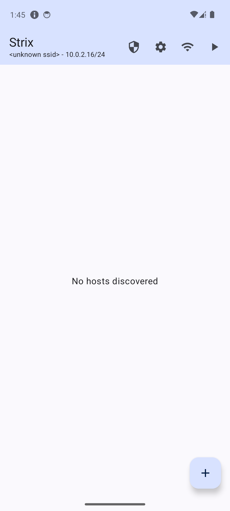

# Strix

> **⚠️ DEVELOPMENT STATUS:** This project is currently under active development and is not yet considered stable.

Strix is an Android network security assessment suite — a modern, ground-up rewrite of the ideas behind [cSploit](https://github.com/cSploit/android), built for current Android versions with a Kotlin + Jetpack Compose stack.

It bundles a full offensive toolchain (Nmap, Hydra, Ettercap, tcpdump, arpspoof) and a cross-compiled Ruby + Metasploit Framework runtime inside a single APK.
> **Strix is intended strictly for authorized security testing, education, and research on networks you own or have explicit written permission to assess. Running these tools against systems you do not control is illegal in most jurisdictions.**

## Screenshots

  

## What Strix does

| Area | What it gives you |
|------|---|
| **Host discovery** | ARP + ICMP sweeps of the local subnet, OUI vendor lookup, live host list |
| **Port / service scan** | Nmap frontend with service + version detection, per-host port list |
| **MITM** | Ettercap + arpspoof driven from the UI, DNS spoofing, packet interception |
| **Packet capture** | On-device tcpdump with live pcap output |
| **Packet forging** | Craft and replay custom packets |
| **Brute force** | Hydra frontend covering all supported service modules (SSH, FTP, HTTP-Form, SMB, RDP, MySQL, Postgres, VNC, Telnet, …) with credential lists |
| **Exploitation** | Full Metasploit Framework running natively on the device via `msfrpcd`; module browser, exploit runner, interactive Meterpreter sessions |
| **Traceroute** | UDP / ICMP traceroute with hop-by-hop render |
| **Router analysis** | Default credential probing against common router admin panels |
| **WiFi keygen** | Offline WPA/WEP default-key recovery — port of cSploit's `WirelessMatcher` with per-vendor algorithms (Alice, Thomson, Huawei, Dlink, Pirelli, Eircom, Sky, Verizon, Ono, Tecom, Telsey, Zyxel, Comtrend, Andared, Infostrada, Megared, Conn, Discus, EasyBox, PBS, OTE, Wlan2, Wlan6) |

## Requirements

- Android **API 29+** (Android 10 or newer)
- **ARM64** device (`aarch64`)
- **Root** (`su` must be available — every offensive feature needs raw socket / kernel access the platform does not grant to regular apps)

## Credits and lineage

- **cSploit** — the original Android pentest suite and the direct conceptual ancestor. Strix inherits its WiFi keygen algorithms and overall product idea.
- **dSploit** — cSploit's predecessor.
- **Nmap, Hydra, Ettercap, tcpdump, arpspoof, Metasploit Framework, Ruby** — the actual engines Strix ships and drives. All credit for the scanning/exploitation capability goes to those projects and their maintainers.

## License

Strix is licensed under the **GNU General Public License v3.0** (GPLv3). See [`LICENSE`](LICENSE) for the full text.

This choice mirrors the licensing of cSploit and dSploit, from which Strix inherits algorithms (notably the `WirelessMatcher` WiFi keygen) and overall design.

## Disclaimer

This software is provided for educational and authorized security testing purposes only. The authors accept no responsibility for misuse. You are solely responsible for ensuring that any use of this tool complies with applicable local, state, national, and international laws.
